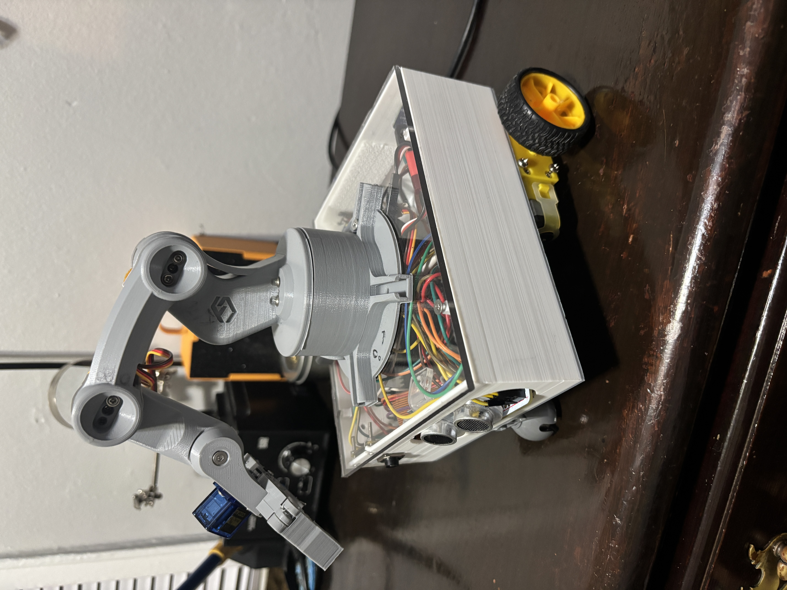
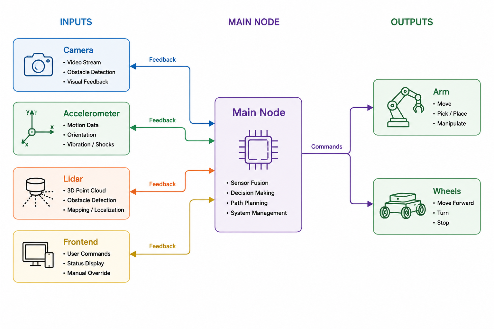
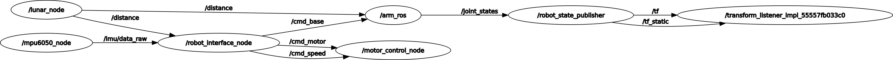
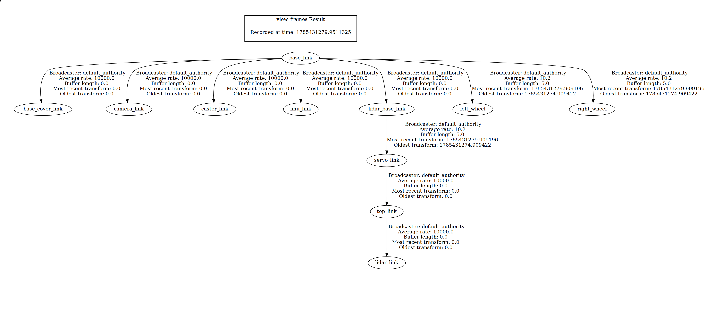

# Project Description 
* A compact 3D-printed mobile robot with a 4-DOF servo arm and dual TT motors for navigation.
Integrated LiDAR for obstacle avoidance, a camera with YOLOv8n for real-time object detection, and an MPU6050 IMU for pose estimation.  
* A web-based interface for remote control of the robot and arm, featuring
live video with detection overlays and accelerometer data. Implemented using 
react and tailwind css to design the frontend and fast api to interact with
the backend.
* 
* [video](./robot-dashboard/public/arm_plexi_bot.mp4)

# System Design

## Software architecture
Main creates an object for each peripheral device which has a class defined: motor wheels, arm, accelerometer, camera, and lidar. Depending on feedback from frontend or physical sensors, call relevant method to determine output. One dockerfile sets up frontend for use on your computer, and
another dockerfile sets up dependencies on raspberry pi 5 to run backend.<br>



## Hardware
* stl files used for 3D printing robot base included in [freecad_files](./free_cad_files)
* pcb board power by a 7.4V LiPo battery 2200mAh, buck converter to 5V to power raspberry pi 5 and 4 servo motors, 7.4V used to power all the tt motors(with encoders)
* The robotic arm shown in was 3D printed using a model created by [FABRI_CREATOR](https://cults3d.com/en/users/FABRI_CREATOR).  
STL file available here: [Mini Robotic Arm on Cults3D](https://cults3d.com/en/3d-model/gadget/mini-robotic-arm)  
Licensed under Cults PU (Personal Use) – No commercial use or AI applications.


### Peripheral Sensors, Motor Drivers Used on Raspberry pi 5
#### IMU BNO055 
* VCC(3.3) -> PCB
* GND -> PCB
* SCL -> PCB
* SDA -> PCB

#### TB6612 Motor Driver 1
* GND -> PCB
* +12V -> PCB
* VCC(3.3) -> PCB
* ENA -> PIN 32 (GPIO 12)
* IN1 -> PIN 11 (GPIO 17)
* IN2 -> PIN 13 (GPIO 27)
* IN3 -> PIN 16 (GPIO 23)
* IN4 -> PIN 18 (GPIO 24)
* ENB -> PIN 33 (GPIO 13)
* STBY -> PIN 22 (GPIO 25) 

#### Encoder TT Motor Left
* VCC(3.3) -> PCB
* GND -> PCB
* A -> PIN 29 (GPIO 5)
* B -> PIN 31 (GPIO 6)

#### Encoder TT Motor Right
* VCC(3.3) -> PCB
* GND -> PCB
* A -> PIN 36 (GPIO 16)
* B -> PIN 37 (GPIO 26)

#### RPLidar 2D
* VCC -> PIN 4(5V)
* RX -> PIN 8 (GPIO 14)
* TX -> PIN 10(GPIO 15)
* GND -> PIN 14


#### PCB
* VCC -> PIN 1 (3.3V)
* SDA -> PIN 3 (SDA)
* SCL -> PIN 5 (SCL)
* GND -> PIN 6
* Connect lithium battery to screw terminal J1
* Connect J3 to buck converter to power Pi
* Connect J2 to get as input: 3.3V, SDA, SCL, GND 
* Connect bno055 to J5
* J7(left), and J8(right) are for encoders
* Connect tb6612 to J9, to get 3.3V(logic), 7.4V(power motors), GND  


#### PCA9685 12-bit PWM controller(removed for now)
* VCC(3.3) -> PCB
* SDA -> PCB
* SCL -> PCB
* GND -> PCB


# Working Setup
## Web App(Frontend)
* Note: Recommended to use another computer for this part to take some of the load off raspberry pi 5. Still works if you decide to use the raspberry pi 5 just a bit slower.
* works fine on ubuntu with docker setup below or on windows use devcontainers:
1. ```docker build -f ./robot_dashboard.Dockerfile -t web-setup . ```
2. ```docker run -it --rm --net=host --name web-container -v /home/jaime/homebot:/workspace web-setup:latest```

## Backend(must run on raspberry pi) 
### subscriber-publisher architecture


### transform tree
 

### Docker setup
1. docker build -f ./humble_pi.Dockerfile -t ros2-setup .
2. docker run -it --rm \
  --init \
  --privileged \
  --net=host \
  --device=/dev/gpiomem \
  --device=/dev/mem \
  --device=/dev/ttyAMA0 \
  --cap-add=SYS_RAWIO \
  -e DISPLAY=$DISPLAY \
  -e QT_X11_NO_MITSHM=1 \
  -v /tmp/.X11-unix:/tmp/.X11-unix:rw \
  -v /sys/class/gpio:/sys/class/gpio:cached \
  -v /dev:/dev \
  -v /run:/run \
  --name ros2-container \
  -v /home/jaime/homebot:/workspaces/homebot \
  jaimec21/jazzy_pi:latest
3. Testing backend without ros2:
```
uvicorn main:app --host 0.0.0.0 --port 8000
```

### workspace setup(backend with ros2)
1. source /opt/jazzy/setup.bash
2. cd /workspaces/homebot/ros2_ws
3. colcon build or or colcon build --symlink-install
4. source install/setup.bash
5. ros2 launch robot_control robot_move_launch.py
6. ros2 launch my_robot_description display.launch.py


### useful commands to remember
1. ros2 service call /capture_image std_srvs/srv/Trigger
2. xhost +local:root and xhost -local:root (for rviz2 on kubuntu)
3. ros2 run tf2_tools view_frames (saves tf frames in pdf)
4. ros2 pkg create my_robot_description --build-type ament_python  (create package)
5. ros2 run rqt_graph rqt_graph (view sub-pub architecture)
6. ros2 run \<package_name\> \<executable_name\>
7. ros2 launch \<package_name\> \<executable_name\>
8. simple docker:
```
docker run -it --rm --init --privileged --net=host --name ros2-container -v /home/jaime/homebot:/workspaces/homebot jaimec21/jazzy_pi:latest
```
9. open another terminal for container:
```
docker exec -it ros2-container bash
```


# To Do 
- install rplidar
- slam/urdf file for frames and kinematics for arm, differential-drive/odom in rviz(measure wheels in meters from centroids)(action?)
- fix dockerfile humble_pi on on pi (image on dockerhub works fine (jazzy_pi))
- add camera to docker and rviz, maybe get stereo camera
- fix tennis navigation
- make a better physical build, make your own arm, design pcb board no cables
- network between computer, and homebot(ros_ip) for faster rviz. Look into networking and firewalls and other security features.
- using pytorch course make an unsupervised grasping model, use jetson orin(check out study material on nvidia(test with olama))   
- add flutter app


[CODE LINK](https://github.com/canizalesjaime/homebot)


## Credits
The robotic arm shown in the video above, is 3D printed using a model created by [FABRI_CREATOR](https://cults3d.com/en/users/FABRI_CREATOR).  
STL file available here: [Mini Robotic Arm on Cults3D](https://cults3d.com/en/3d-model/gadget/mini-robotic-arm)  
Licensed under Cults PU (Personal Use) – No commercial use or AI applications.
